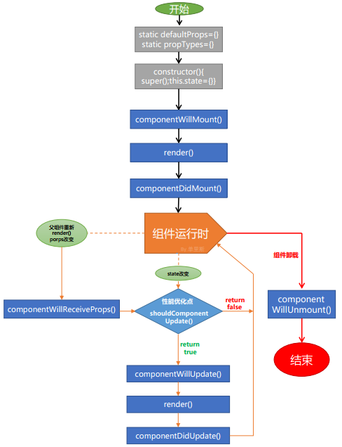
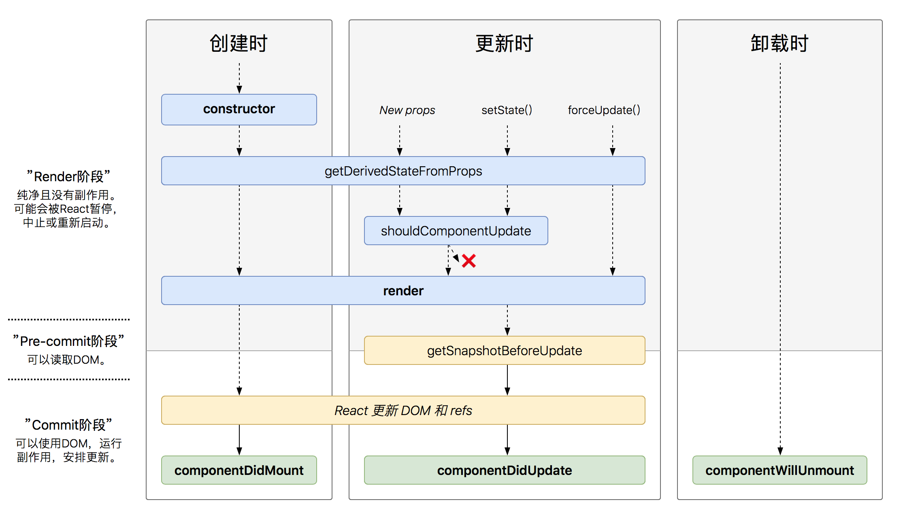

# 生命周期

## Before React v16.3

## After React v16.3

React v16.3，引入了两个新的生命周期函数：

* **getDerivedStateFromProps**
* **getSnapshotBeforeUpdate**


**Tips**：getDerivedStateFromProps 实际上就是用来取代以前的 componentWillReceiveProps


随着 `getDerivedStateFromProps` 的推出，同时deprecate了一组生命周期API，包括：

* **componentWillReceiveProps**
* **componentWillMount**
* **componentWillUpdate**

新的生命周期图如下图所示：

