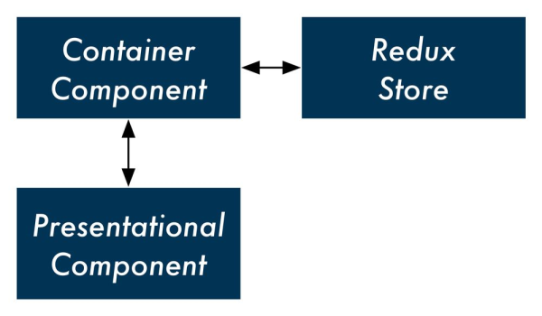

# Redux 组件

Redux 的一个重要思想是将组件主要分为 **container（容器型） 组件**和 **presentational（展示型） 组件**。

* container 主要是为 presentational 组件提供一个 **数据容器**，这里的数据包括属性和方法（需要 dispatch 的方法，和不需要 dispatch 的方法）。
* presentational 组件仅仅作为拿到数据（血液）后的展示作用，上承接 contianer 传过来的数据，下接ui 组件。

一个完整 React App 的组件树，根节点即 mountNode，叶子节点应该是 presentational 组件或 ui 组件，中间的节点是 container 组件，主要用与传递和监听数据，作为一个数据的中间容器。

