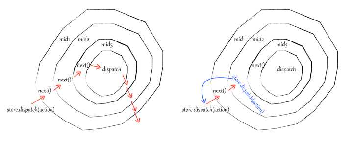

# Middleware

请慎用自定义的 redux-middleware，错误的配置可能会影响到其他 middleware。



```javascript
applyMiddleware(m1, m2, m3)
```


**注意**：在执行middleware的时候顺序是从左至右，即：m1, m2, m3。在 Rematch 的 middlewares 数组中的顺序也是从左至右。


## redux-observables

[https://github.com/redux-observable/redux-observable](https://github.com/redux-observable/redux-observable)

