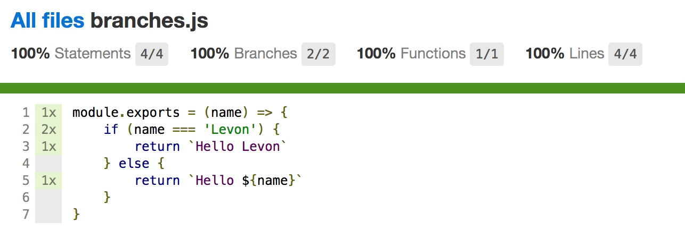

# 单元测试

TDD（Test-driven development）和单元测试密不可分，但 TDD 并不是银弹，不必一味地追求，为写测试而写测试，这需要自己去把控和权衡。

> 老板为我的代码付报酬，而不是测试，所以，我对此的价值观是——测试越少越好，少到你对你的代码质量达到了某种自信（我觉得这种的自信标准应该要高于业内的标准，当然，这种自信也可能是种自大）。如果我的编码生涯中不会犯这种典型的错误（如：在构造函数中设了个错误的值），那我就不会测试它。我倾向于去对那些有意义的错误做测试，所以，我对一些比较复杂的条件逻辑会异常地小心。当在一个团队中，我会非常小心的测试那些会让团队容易出错的代码。——[Kent Beck](https://zh.wikipedia.org/wiki/%E8%82%AF%E7%89%B9%C2%B7%E8%B2%9D%E5%85%8B)

大牛的想法有他自己的底气，TDD 本身也是一个具有争议的话题。对于我们开发者还是秉持以下原则：

> 测试用例粒度要尽可能地小

> 写得要有意义和价值

> 不要教条主义

以上大而空，具体一点可以参考以下做法：

确认每个组件是否都有执行过单元测试，确认每个 props 和 callbacks 都在集成测试的时候传递给了对应的子组件。

为了保证组件测试用例的小颗粒度和简单化，你需要熟悉一下 [selectors](http://airbnb.io/enzyme/docs/api/selector.html)，Enzyme 提供了丰富的 selector 去深入组件树。

另外，建议使用 [sinon](http://sinonjs.org/) 来测试 callbacks 回调函数，不要在组件中测试业务逻辑，这真不是个好注意。而是应该将业务逻辑从组件中解耦并对其进行测试。

## Jest

Jest 是 Facebook 开源的一个测试框架，相对其他测试框架，其特点有：

* **开箱即用**：内置常用的测试工具，如自带断言、测试覆盖率等，减少了一些插件的配置。
* **特有的快照测试功能：**通过比对 UI 代码生成的快照文件，确保组件呈现正确的样式。
* **速度快**：测试用例是多进程并行的，而且只执行发生改变的文件所对应的测试，提升了测试速度。
* **兼容性好**：兼容 Jasmine 框架语法，又新增了一些新的便捷功能。
* **JSDOM**：不需要真实 DOM 环境执行，而是 JSDOM 模拟的 DOM。

## 测试覆盖率

> 把测试覆盖作为质量目标没有任何意义，而我们应该把它作为一种发现未被测试覆盖的代码的手段。   ——[Martin Fowler](https://zh.wikipedia.org/wiki/%E9%A9%AC%E4%B8%81%C2%B7%E7%A6%8F%E5%8B%92)

使用测试覆盖率之前请先看这边文章：[代码覆盖率工具 Istanbul 入门教程](http://www.ruanyifeng.com/blog/2015/06/istanbul.html)

Jest 内置了测试覆盖率工具 [istanbul](https://github.com/gotwarlost/istanbul)，要开启，可以直接在命令中添加 `--coverage` 参数，或者在 package.json 文件进行更详细的[配置](https://jestjs.io/docs/zh-Hans/configuration.html#collectcoverage-boolean)。

运行 istanbul 除了会再终端展示测试覆盖率情况，还会在项目下生产一个 coverage 目录，内附一个测试覆盖率的报告，让我们可以清晰看到分支的代码的测试情况。比如下面这个例子：

```javascript
// branches.js
export default (name) => {
    if (name === 'Levon') {
        return `Hello Levon`
    } else {
        return `Hello ${name}`
    }
}

// branches.test.js
import branches './branches.js'

describe('Multiple branches test', () => {
    it('should get Hello Levon', () => {
          expect(branches('Levon')).toBe('Hello Levon')
    });
    // it('should get Hello World', () => {
    //       expect(branches('World')).toBe('Hello World')
    // });  
})
```

运行 `jest --coverage` 可看到生产的报告里展示了代码的覆盖率和未测试的行数：


如果我们把 branches.test.js 中的注释去掉，跑遍测试对象中的所有分支，测试覆盖率就是100%了：



